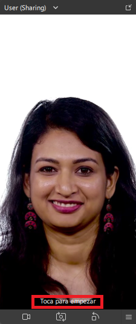
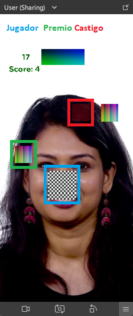
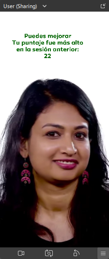

# Juego de destreza en META SPARK AR
<!-- Hola mundo -->
__Crear un juego de realidad aumentada con experiencia interactiva.__    
Atrapa el mayor número de recompensas posibles (gana puntos) esquivando los castigos (pierde puntos). El jugador controla el juego con la nariz moviéndose en un plano 2D, se termina la partida en un tiempo determinado (30s) mostrando el puntaje más alto en las sesiones anteriores. El juego solo funciona con la cámara frontal del dispositivo.

|inicio|juego|final|ejemplo|
|-|-|-|-|
||||

## Tabla de contenido:
- [🚀 Comenzando][1]
    - [📋 Pre-requisitos][1.1]
    - [🔧 Instalación][1.2]
- [Ejecutando las pruebas ⚙️][2]
- [Construido con 🛠️][3]
- [Contribuyendo 🖇️][4]
- [Versionado 📌][5]
- [Autores ✒️][6]
- [Licencia 📄][7]
- [Expresiones de Gratitud 🎁][8]

## Comenzando 🚀
El repositorio se encuentra el archivo __juego_destreza.arproj__ .  
Un archivo con la extensión .arproj es un proyecto de __Meta Spark AR__. El archivo incluye la configuración de la escena, las capas y los efectos que se han aplicado en el proyecto.

### Pre-requisitos 📋
* [Meta Spark Studio](https://sparkar.facebook.com/ar-studio/learn/downloads/#making-and-testing-effects)
* [Meta Spark para VSC](https://marketplace.visualstudio.com/items?itemName=SparkAR.spark-ar-studio)

### Instalación 🔧

Ejecuta el archivo [juego_destreza.arproj](juego_destreza.arproj) desde _Meta Spark AR_ que contiene todos los recursos necesarios.

## Ejecutando las pruebas ⚙️
La aplicación móvil Spark AR Player es una aplicación gratuita que te permite probar tus filtros de Spark AR en tiempo real en dispositivos móviles. Puedes descargarla desde la App Store de Apple o Google Play Store.

## Construido con 🛠️
* Meta Spark Studio
* [scripting API](https://sparkar.facebook.com/ar-studio/learn/reference/scripting/summary)

## Contribuyendo 🖇️

Por favor lee el [CONTRIBUTING.md]() para detalles de nuestro código de 
conducta, y el proceso para enviarnos pull requests.
## Versionado 📌
Usamos [SemVer](http://semver.org/) para el versionado. Para 
todas las versiones disponibles, mira los [tags en este 
repositorio](https://github.com/Alfonso6z/juego_destreza_sparkar/tags).

## Autores ✒️
* [**Alfonso González Zempoaltca**](https://github.com/Alfonso6z)
 - *Trabajo Inicial* 
 - *Documentación*

## Licencia 📄
Este proyecto está bajo la Licencia MIT - mira el 
archivo [LICENSE](LICENSE.md) para detalles

## Expresiones de Gratitud 🎁
* Comenta a otros sobre este proyecto 📢
* Invita una cerveza 🍺 o un café ☕ a alguien del equipo. 
* Da las gracias públicamente 🤓.
---
⌨️ con ❤️ por [Alfonso Gónzalez Zempoalteca](https://github.com/Alfonso6z)😊

[1]: #comenzando-🚀
[1.1]: #pre-requisitos-📋
[1.2]: #instalación-🔧
[2]: #ejecutando-las-pruebas-⚙️
[3]: #construido-con-🛠️
[4]: #contribuyendo-🖇️
[5]: #versionado-📌
[6]: #autores-✒️
[7]: #licencia-📄
[8]: #expresiones-de-gratitud-🎁
